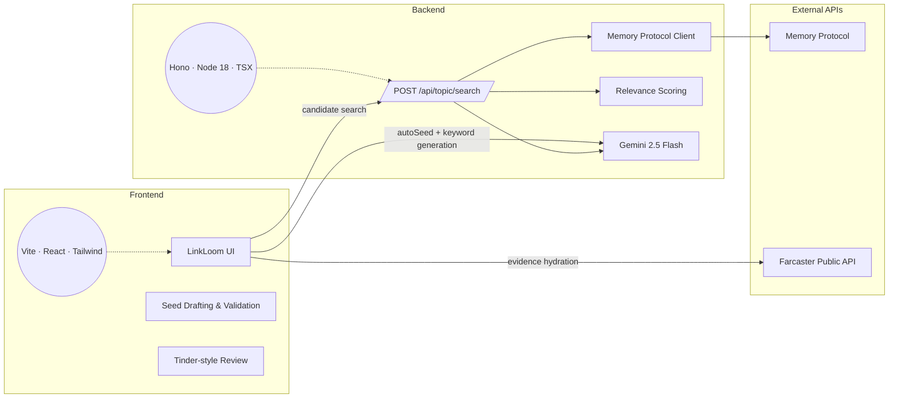
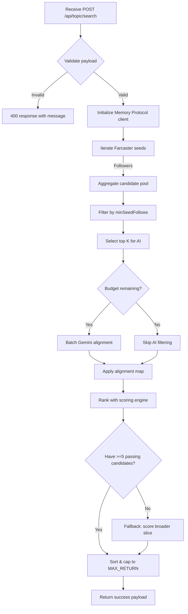
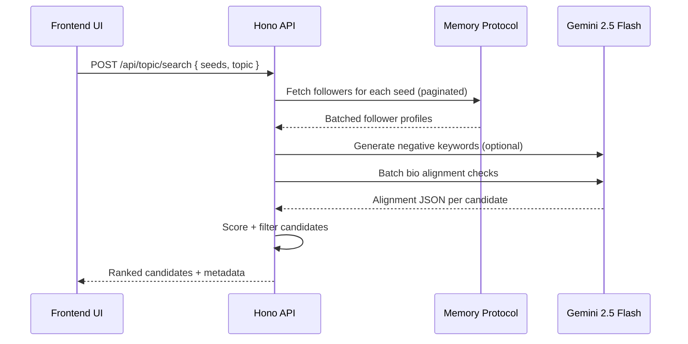

# LinkLoom

LinkLoom is our hackathon project submission: a networking copilot that helps founders (and the teams that support them) discover the right people based on what they build, start warm conversations, and swipe through alternatives when a match is not the vibe. The project stitches together a React front end for drafting and validating "seed" accounts with a TypeScript/Hono API that cross-references Farcaster social graphs, applies Gemini 2.5 Flash for semantic filtering, and returns an explainable ranking.


## Table of Contents
1. [Architecture Overview](#architecture-overview)
2. [Frontend Experience](#frontend-experience)
3. [Backend Services](#backend-services)
4. [Backend Processing Flow](#backend-processing-flow)
5. [Data Sources & Integrations](#data-sources--integrations)
6. [Local Setup](#local-setup)
7. [Environment Configuration](#environment-configuration)
8. [Development Scripts](#development-scripts)
9. [Troubleshooting & Tips](#troubleshooting--tips)
10. [Project Structure](#project-structure)

## Architecture Overview

LinkLoom is intentionally split into independent frontend and backend workspaces so hackathon contributors can parallelize quickly. The frontend ships as a Vite-powered React app, while the backend is a standalone Hono server that can be deployed to any Node-friendly environment or edge runtime.



## Frontend Experience

- **Stacks & tooling**: React 19, TypeScript, Vite 7, Tailwind CSS 4, Redux Toolkit, TanStack Query, Wagmi + Farcaster Mini App connector, Sonner toasts.
- **Core workflows**:
  - _Auto-seed_: Calls Gemini from the browser (with rate limiting) to propose Farcaster/Twitter handles and topic keywords tailored to the opportunity.
  - _Seed refinement_: Users edit, add, or remove handles before triggering backend validation so the matches stay relevant to the mission.
  - _Candidate review_: Ranked results from the backend render as sortable tables and an interactive swipe deck for matching or passing to see more people.
  - _Farcaster hydration_: The client can progressively fetch extra profile evidence using the Farcaster public API to show receipts alongside Gemini rationales for each potential match.
- **State & persistence**:
  - Auth/session details live in Redux and persist via AES-encrypted `localStorage` helpers.
  - Axios is pre-configured to attach tokens or call the same-origin backend depending on deployment.

## Backend Services

The backend resides in `backend/` and exposes a single `POST /api/topic/search` endpoint.

- **Runtime**: Node 18+ using Hono, served via `@hono/node-server` and hot-reloaded locally with `tsx`.
- **Pipelines**:
  1. **Seed harvesting** – For every Farcaster handle supplied by the UI, the Memory Protocol client paginates followers (up to configured caps) and collates unique candidates.
  2. **Keyword intelligence** – Extracts keywords from the topic query, generates optional negative keywords via Gemini, and prepares scoring thresholds.
  3. **AI alignment** – Batches top candidates into Gemini prompts to filter spam or off-topic accounts using bios + usernames.
  4. **Scoring** – Applies a deterministic scoring utility weighting seed overlap, keyword matches, and follower credibility to produce explainable `why` fields.
  5. **Result shaping** – Sorts, caps, and returns the top candidates with metadata, keeping logs verbose for fast hackathon debugging.
- **Observability**: Console logging surfaces environment sanity checks, API usage, fallbacks, and failure reasons so you can trace each stage quickly during demos.

## Backend Processing Flow





## Data Sources & Integrations

| Integration | Purpose | Notes |
|-------------|---------|-------|
| **Gemini 2.5 Flash** | Generates initial seeds/keywords on the client and powers backend negative keyword + alignment checks. | Requires separate API keys for browser (VITE) and server contexts. |
| **Memory Protocol API** | Provides authenticated Farcaster follower graphs with pagination metadata. | Enforced via `MEMORY_PROTOCOL_API_TOKEN`; requests are capped per seed to avoid rate issues. |
| **Farcaster Public API** | Optional, unauthenticated fetches for verifying individual profiles or casts directly from the frontend. | Used for progressive evidence gathering during candidate review. |

## Local Setup

### Prerequisites
- Node.js ≥ 18 (works with both npm and yarn)
- pnpm/yarn/npm for dependency management (examples below use `yarn` for the frontend and `npm` for the backend, but any Node-compatible manager works)
- A Gemini API key and Memory Protocol token

### Clone & Install
```bash
git clone https://github.com/your-org/LinkLoom.git
cd LinkLoom

# Frontend workspace
yarn install

# Backend workspace
cd backend
npm install
cd ..
```

### Run the Stack
Open two terminals for a classic hackathon split:

```bash
# Terminal 1 – frontend
yarn dev
# serves http://localhost:5173
```

```bash
# Terminal 2 – backend
cd backend
npm run dev
# serves http://localhost:3001
```

Configure your frontend `.env` so `VITE_APP_API_URL` points to the backend origin (e.g., `http://localhost:3001`). The frontend will then proxy topic searches to `/api/topic/search` while continuing to call Gemini directly for on-device seeding.

## Environment Configuration

### Frontend (`.env` at repository root)
| Variable | Required | Description |
|----------|----------|-------------|
| `VITE_GEMINI_API_KEY` | ✅ | Browser key for auto-seeding and keyword refinement. |
| `VITE_SECRET_KEY` | ✅ | AES secret for encrypting local session data; use a strong random string. |
| `VITE_APP_API_URL` | ➖ | Optional override for Axios base URL. Set to your backend URL in local dev. |

### Backend (`backend/.env`)
| Variable | Required | Description |
|----------|----------|-------------|
| `MEMORY_PROTOCOL_API_TOKEN` | ✅ | Token for Memory Protocol follower lookups. |
| `GEMINI_API_KEY` | ✅ | Server-side Gemini key for negative keyword generation and bio alignment. |
| `PORT` | ➖ | Port for the Hono server (defaults to `3001`). |
| `TOPIC_SEARCH_BUDGET_MS` | ➖ | Override default processing budget (60s). |
| `TOPIC_SEARCH_MAX_RETURN` | ➖ | Limit number of candidates returned (defaults to 30, min 5). |

Copy `.env.example` from `backend/` (if present) and add your real secrets. Do **not** reuse browser keys on the server—Gemini enforces separate quotas.

## Development Scripts

| Workspace | Command | Description |
|-----------|---------|-------------|
| Frontend | `yarn dev` | Start the Vite dev server with HMR. |
| Frontend | `yarn build` | Type-check and bundle the production app. |
| Frontend | `yarn preview` | Preview the production build locally. |
| Frontend | `yarn lint` | Run ESLint across the project. |
| Backend | `npm run dev` | Run Hono with `tsx` live reloading. |
| Backend | `npm run build` | Compile TypeScript into `dist/`. |
| Backend | `npm start` | Serve the compiled backend. |

### Testing the API manually
```bash
curl -X POST http://localhost:3001/api/topic/search \
  -H "Content-Type: application/json" \
  -d @backend/example-request.json
```

## Troubleshooting & Tips

- **Gemini rate limits** – The frontend gracefully surfaces overload/network messages; retry after a short wait. On the backend, reduce `caps.hydrateTopK` or increase `TOPIC_SEARCH_BUDGET_MS` if timeouts appear.
- **Memory Protocol quota** – Each seed can trigger up to ~20 paginated requests. Adjust `maxSeedFollowersPerSeed` in the request body during testing to stay within limits.
- **CORS issues** – The backend enables permissive CORS via Hono; if deploying behind an edge proxy, tighten origin allow-lists accordingly.
- **Farcaster username cleanup** – Prompts remove `.eth`/`.base` suffixes before validation so Memory Protocol queries stay accurate; the backend logging will flag any seeds that fail hydration.
- **Cloud demos** – Pair the frontend with Vercel/Netlify and host the backend on a serverless Node environment. Use secrets management to populate both `.env` files.

## Project Structure

```text
.
├── README.md
├── package.json             # Frontend workspace manifest (React/Vite)
├── src/                     # Frontend source code (features, components, lib)
├── public/                  # Static assets served by Vite
├── backend/
│   ├── package.json         # Backend manifest (Hono API)
│   ├── src/                 # Backend handlers, lib clients, and types
│   └── example-request.json # Sample payload for quick curl tests
└── ...
```

Happy linking—pull requests, feature ideas, and demo feedback are all welcome!
